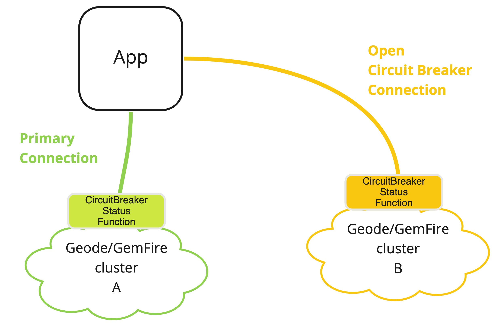
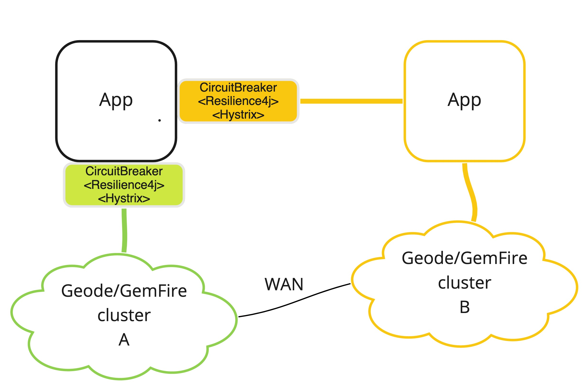

# dataTx-geode-circuitbreaker-demo

BETA example demo application on how to implement 
a [circuit breaker design pattern](https://en.wikipedia.org/wiki/Circuit_breaker_design_pattern) with [Apache Geode](https://geode.apache.org)/[GemFire](https://pivotal.io/pivotal-gemfire).

This application demonstrates switching between cluster A to cluster B 
when A is down. It then switches back to A when it is available again.

The application uses [Spring Data Geode](https://spring.io/projects/spring-data-geode) to manage the 
connection to an Apache Geode/GemFire cluster. Apache Geode supports connecting to
multiple clusters using a [Pool](https://geode.apache.org/releases/latest/javadoc/org/apache/geode/cache/client/Pool.html).
Two pools (A and B) are used to maintain connections to clusters.

On the server-side clusters, a simple [Apache Geode/GemFire function](https://geode.apache.org/docs/guide/11/developing/function_exec/function_execution.html) is used to determine
if the cluster is available. See [CircuitBreakerStatusFunc](circuitBreakerFunctions/src/main/java/io/pivotal/services/dataTx/circuitBreaker/functions/CircuitBreakerStatusFunc.java) function for details.
The Function is used to execute on either Pool A or B.
 
Based on detected failures from the function execution status checks, the Spring Data Geode connect context is switched dynamically between the two clusters.

# Disclaimer

This is a working **BETA** implementation of a circuit breaker.

Note the preferred approach to switching the config to point from cluster A to cluster B during the application restart.

This allows operations to manage the failover operations.
If two Disaster Recover Data Centers are identical, then a global load balancer 
can be used for active-active architectures. 

This example uses the Spring context to gratefully handle networking 
resources connections. This demo has not been analyzed for potential 
networking or memory leaks. Special care must be taken if the 
client uses client side listeners as such Continuous Queries to manage resources
and restart logic.

It was also noted that past production implementations
of this circuit breaker have experienced challenges.
A very senior advisor noted that pure GemFire API circuit breaker
 implementations traditional have been an anti-pattern. 

 
 ## Alternative Preferred Options
 
 The following architecure has been generally been viewed as a more reliable circuit breaker
 implementation for applications, then this demo application. 

In this case, the client can use a standard circuit breaker pattern implementation such as 
Resilience4j or Hystrix. Failure detection can delegate to an App connected to another GemFire cluster (cluster A to B).

This architecture would also need ACTIVE to ACTIVE WAN replication between the clusters.

 

